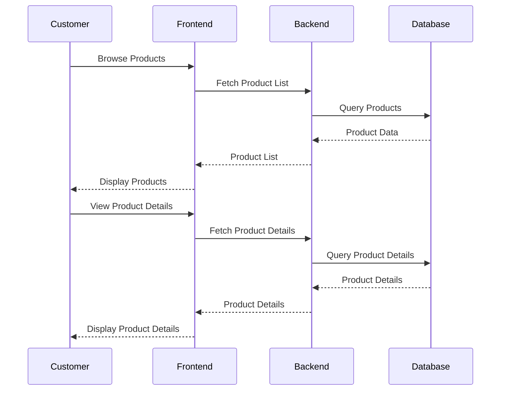

# Sequence Diagram

## Description
The Sequence Diagram represents the main flow of the application, showcasing the interaction between components.

```mermaid
sequenceDiagram
Customer->>Frontend: Browse Products
Frontend->>Backend: Fetch Product List
Backend->>Database: Query Products
Database-->>Backend: Product Data
Backend-->>Frontend: Product List
Frontend-->>Customer: Display Products
Customer->>Frontend: View Product Details
Frontend->>Backend: Fetch Product Details
Backend->>Database: Query Product Details
Database-->>Backend: Product Details
Backend-->>Frontend: Product Details
Frontend-->>Customer: Display Product Details
```